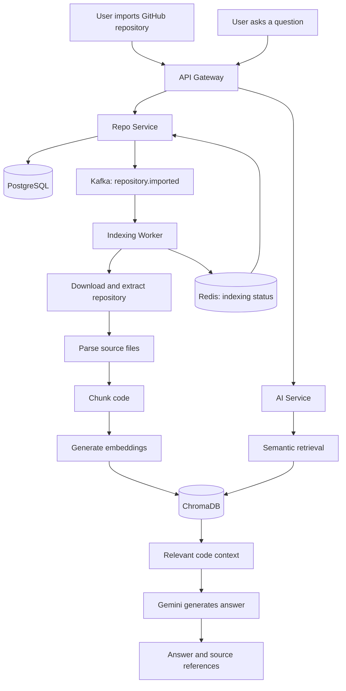
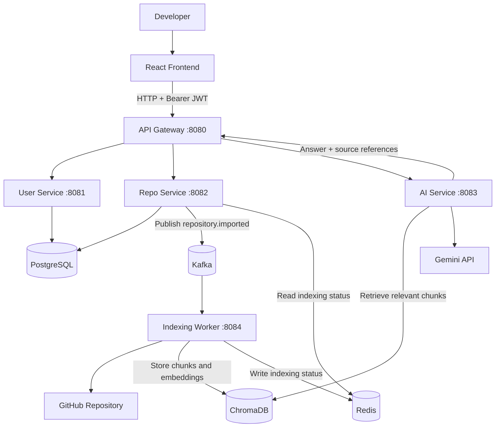
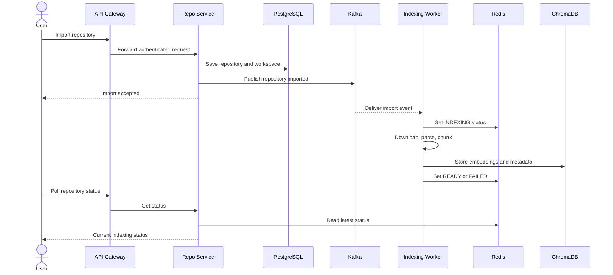
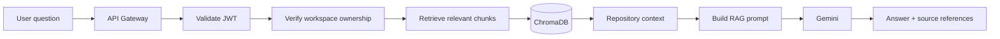
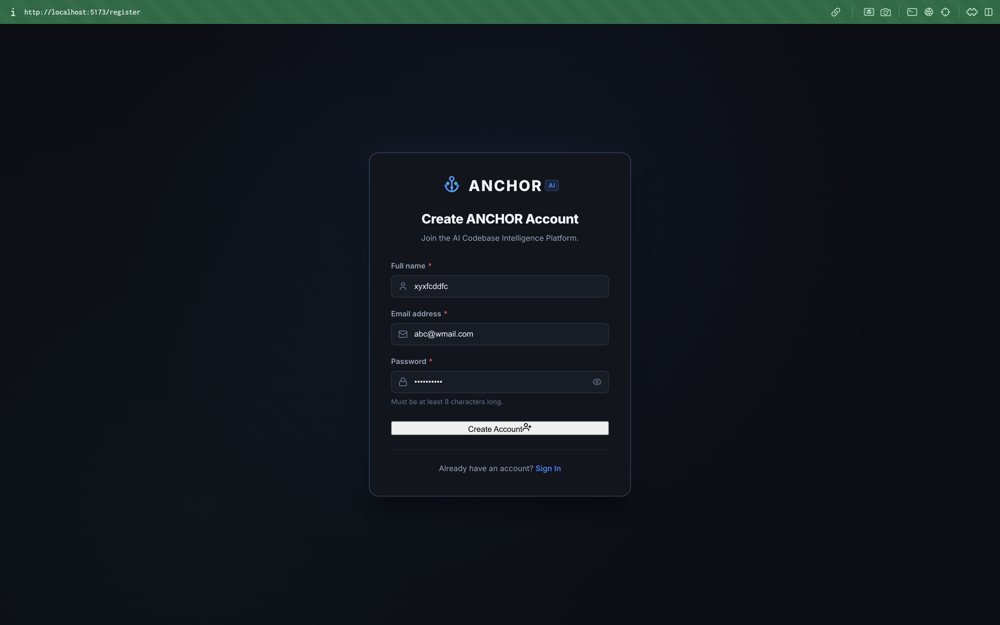
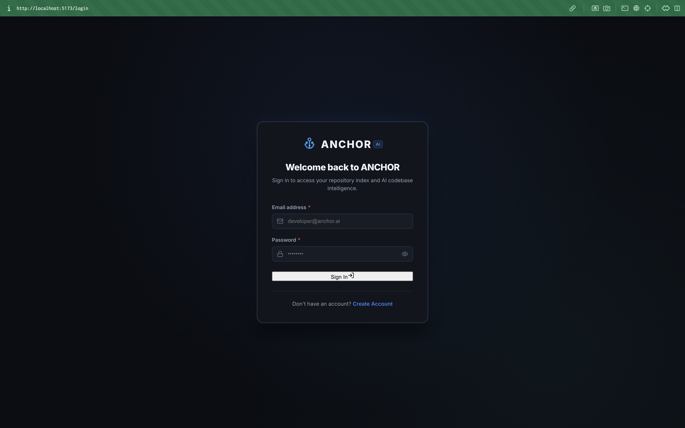
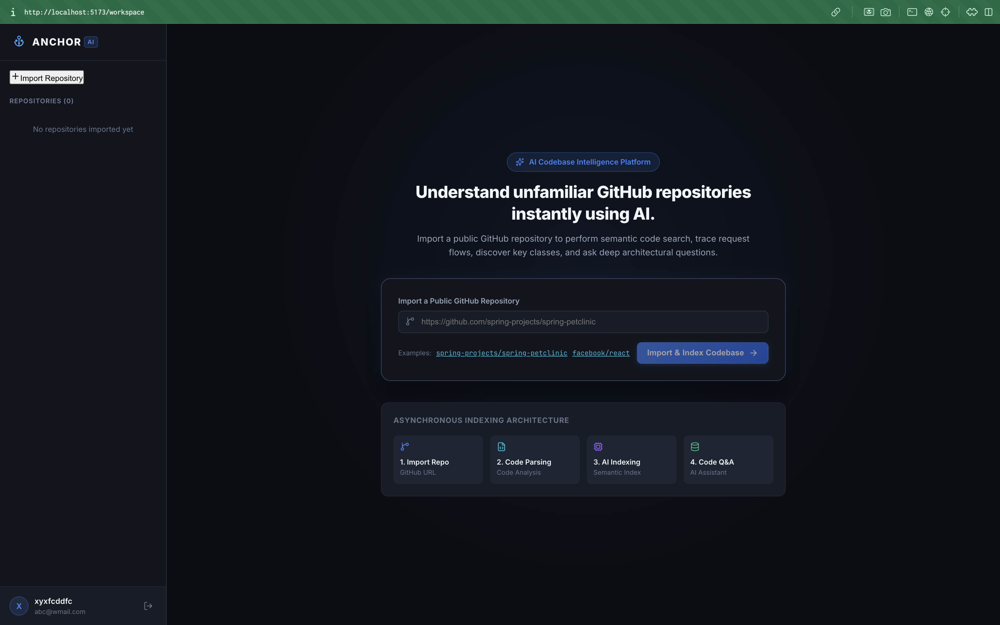
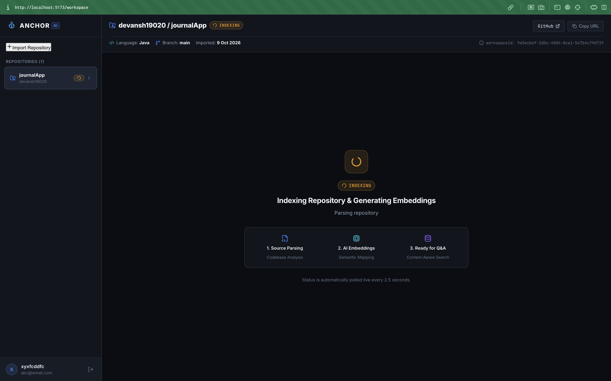
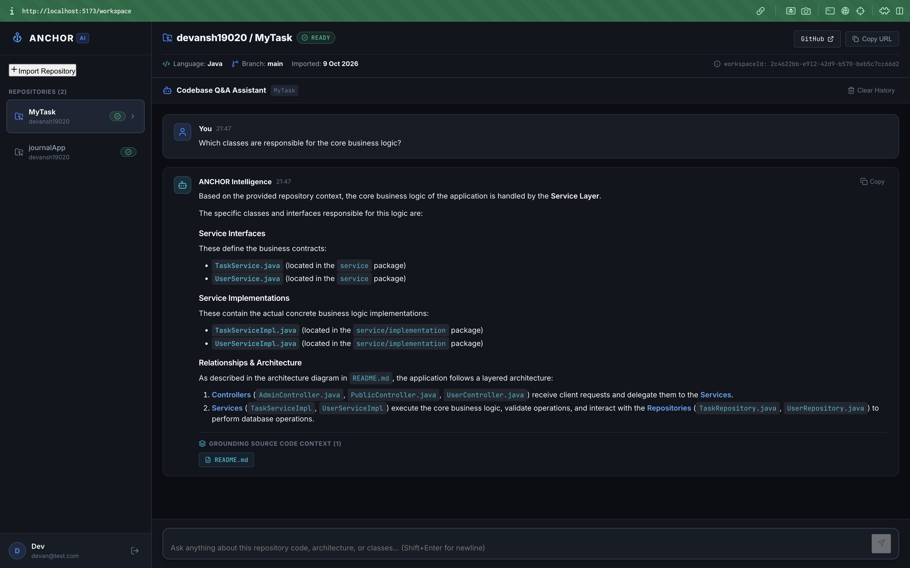

# ANCHOR — AI Codebase Intelligence Platform

**Understand any codebase. Trace the logic. Ask better questions.**

ANCHOR is an AI-powered codebase intelligence platform that helps developers understand unfamiliar GitHub repositories through semantic code search and Retrieval-Augmented Generation (RAG). Instead of manually navigating hundreds of files, developers can ask questions about a repository and receive context-aware answers grounded in its source code.

ANCHOR combines repository parsing, code chunking, vector embeddings, semantic retrieval, and generative AI to make code exploration faster and more intuitive.

> **Project status:** Active development. The backend repository-indexing and RAG pipeline has been implemented. The frontend and complete integration workflow are being developed and validated.

---

## Table of Contents

- [Overview](#overview)
- [Key Features](#key-features)
- [How It Works](#how-it-works)
- [Architecture](#architecture)
- [Technology Stack](#technology-stack)
- [Project Structure](#project-structure)
- [Getting Started](#getting-started)
- [Configuration](#configuration)
- [API Reference](#api-reference)
- [Supported Files](#supported-files)
- [Security](#security)
- [Current Limitations](#current-limitations)
- [Roadmap](#roadmap)
- [Contributing](#contributing)
- [Screenshots](#screenshots)

---

## Overview

Understanding a large or unfamiliar codebase is a common challenge for software developers. Finding where an application starts, tracing an authentication flow, identifying the classes responsible for business logic, or understanding database interactions can require considerable manual effort.

ANCHOR addresses this problem by creating a searchable semantic representation of a repository and using that context to answer natural-language questions.

### Example questions

- Explain the architecture of this repository.
- Where does application execution begin?
- Trace the authentication flow from controller to database.
- Which classes handle database operations?
- Explain how a particular service interacts with other components.
- What is the responsibility of this class?
- How does data flow through the application?

The objective is to make codebases easier to explore without requiring developers to read every file before understanding the overall system.

---

## Key Features

### 1. GitHub Repository Import

Import a supported public GitHub repository through its URL.

ANCHOR retrieves repository metadata, creates an isolated workspace, and initiates the indexing pipeline.

### 2. Automated Codebase Indexing

An asynchronous worker processes imported repositories through a pipeline that includes:

- Repository downloading and extraction
- File filtering and parsing
- Code chunking
- Embedding generation
- Vector storage

Kafka decouples repository import from the potentially time-consuming indexing process.

### 3. Semantic Code Search

Repository chunks are converted into vector embeddings and stored in ChromaDB. Semantic retrieval enables relevant code context to be found using the meaning of a question rather than relying exclusively on exact keyword matches.

### 4. AI-Powered Codebase Q&A

ANCHOR uses Retrieval-Augmented Generation to retrieve relevant code context and provide it to a generative AI model.

Answers are generated using the retrieved repository context, helping developers investigate architecture, implementation details, and application workflows.

### 5. Source References

AI responses include source filenames returned by the retrieval pipeline, helping developers identify where relevant context originated.

### 6. Asynchronous Indexing Status

Repository indexing status is tracked through Redis, allowing the application to distinguish between repositories that are being processed, are ready for queries, or have failed.

### 7. Microservices Architecture

The backend is organized into separate services for authentication, repository management, AI interaction, and indexing. This separation supports independent responsibilities and clearer service boundaries.

### 8. Repository-Scoped Workspaces

Each imported repository is associated with a workspace identifier used to scope its indexed context and AI queries.

---

## How It Works



### Indexing workflow

1. The user submits a GitHub repository URL.
2. The API Gateway forwards the request to the Repo Service.
3. The Repo Service validates the URL, retrieves metadata, creates a workspace, persists the repository, and publishes an import event to Kafka.
4. The Indexing Worker consumes the event.
5. The worker downloads and extracts the repository into a temporary workspace.
6. Supported files are parsed and split into smaller chunks.
7. Embeddings are generated for the chunks.
8. The chunks and associated metadata are stored in ChromaDB.
9. Redis is updated with the indexing status.
10. Once indexing is complete, the repository can be queried through the AI Service.

### Question-answering workflow

1. The user selects an indexed repository and submits a question.
2. The API Gateway authenticates the request and forwards it to the AI Service.
3. The AI Service retrieves relevant chunks from the vector store using the repository's workspace identifier.
4. The retrieved context is used to construct a prompt.
5. Gemini generates an answer using the available context.
6. The API returns the answer and associated source filenames.

---

## Architecture

ANCHOR uses a service-oriented backend architecture with an asynchronous indexing pipeline.

| Component       | Responsibility                             |         Local port |
| --------------- | ------------------------------------------ | -----------------: |
| React Frontend  | User interface and API interaction         | Vite default: 5173 |
| API Gateway     | Request routing and JWT validation         |               8080 |
| User Service    | Registration, login, and user identity     |               8081 |
| Repo Service    | Repository metadata, ownership, and import |               8082 |
| AI Service      | Semantic retrieval and AI chat             |               8083 |
| Indexing Worker | Repository processing and vector indexing  |               8084 |

The frontend should communicate with backend services exclusively through the API Gateway.

### System architecture



### Repository indexing sequence



### AI question-answering flow



The diagrams describe the intended request flow. Workspace ownership must be checked server-side before retrieval; a workspace ID by itself is not proof of authorization.

### Service responsibilities

| Component | Responsibility | Local port |
|---|---|---:|
| React frontend | UI and gateway API requests | Vite default: `5173` |
| API Gateway | Request routing and JWT validation | `8080` |
| User Service | Registration, login, JWT issuance | `8081` |
| Repo Service | Repository metadata, import, ownership, status | `8082` |
| AI Service | Retrieval, prompt construction, Gemini chat | `8083` |
| Indexing Worker | Download, parse, chunk, embed, index | `8084` |
| PostgreSQL | Persistent user and repository metadata | `5432` if local |
| Kafka | Asynchronous repository import events | `9092` |
| Redis | Indexing status | `6379` |
| ChromaDB | Vector storage and semantic retrieval | `8000` |

Ports are local development defaults. Internal service and infrastructure ports should not be exposed publicly in production.

### Infrastructure components

| Technology   | Purpose                                   |
| ------------ | ----------------------------------------- |
| PostgreSQL   | Persistent user and repository metadata   |
| Apache Kafka | Asynchronous repository-import events     |
| Redis        | Repository indexing status                |
| ChromaDB     | Vector embeddings and semantic retrieval  |
| Gemini API   | Embedding generation and AI responses     |
| GitHub       | Source repository and repository metadata |

The ports listed above are local development defaults. Infrastructure ports and credentials should be configured for the environment in which ANCHOR runs.

---

## Technology Stack

### Frontend

- React
- Vite
- JavaScript
- CSS
- React Router
- Lucide React

*Confirm the final list against the generated frontend's actual dependencies.*

### Backend

- Java 21
- Spring Boot 3.5.x
- Spring Cloud Gateway
- Spring Data JPA
- Spring Data Redis
- Spring for Apache Kafka
- REST APIs
- JWT-based authentication
- BCrypt password hashing

### AI and retrieval

- Google Gemini API
- Embeddings and vector similarity search
- ChromaDB
- Retrieval-Augmented Generation (RAG)
- Repository parsing and code chunking

### Infrastructure

- PostgreSQL
- Apache Kafka
- Redis
- Docker for local infrastructure services

---

## Project Structure

The repository is organized around independently runnable services. A representative layout is:

```text
ANCHOR/
├── api-gateway/
├── user-service/
├── repo-service/
├── ai-service/
├── indexing-worker/
├── frontend/
├── docker-compose.yml
├── .gitignore
└── README.md
```

The actual directory names may differ depending on how the projects are organized locally.

### Service responsibilities

**`api-gateway/`**

Routes incoming requests and validates JWTs before forwarding protected requests to backend services.

**`user-service/`**

Manages user registration, login, password hashing, and JWT issuance.

**`repo-service/`**

Manages repository metadata, import operations, ownership checks, and publication of indexing events.

**`ai-service/`**

Handles natural-language questions, semantic retrieval, prompt construction, and Gemini responses.

**`indexing-worker/`**

Consumes repository import events and runs the download, extraction, parsing, chunking, embedding, and vector-storage pipeline.

**`frontend/`**

Contains the React application for authentication, repository management, indexing status, and AI-powered codebase exploration.

---

## Getting Started

The following instructions describe the intended local development setup. Verify the actual project scripts, environment variables, and infrastructure configuration before running the commands.

### Prerequisites

Install or configure:

- Java 21
- Maven, or the Maven Wrapper included in each service
- Node.js and npm
- PostgreSQL
- Apache Kafka
- Redis
- ChromaDB
- A Google Gemini API key
- Git

Docker can be used to run the infrastructure dependencies locally.

### 1. Clone the repository

```bash
git clone <YOUR_GITHUB_REPOSITORY_URL>
cd ANCHOR
```

Replace the placeholder with the actual GitHub repository URL.

### 2. Configure environment variables

Create local environment configuration for each service using its existing configuration files.

Configure the required database connection, Kafka bootstrap server, Redis connection, ChromaDB endpoint and collection, Gemini API key, and JWT secret.

Do not commit real credentials to Git.

See [Configuration](#configuration) below.

### 3. Start infrastructure services

Start PostgreSQL, Kafka, Redis, and ChromaDB using your configured local services or Docker Compose setup.

If a `docker-compose.yml` is available, inspect its service names and ports before running:

```bash
docker compose up -d
```

This command only works when the Compose file defines the required services.

Verify that each dependency is reachable before starting the Spring Boot applications.

### 4. Start the backend services

Run each Spring Boot application using its Maven Wrapper from the corresponding service directory.

For example:

```bash
cd api-gateway
./mvnw spring-boot:run
```

Repeat for the other services:

```bash
cd user-service
./mvnw spring-boot:run
```

```bash
cd repo-service
./mvnw spring-boot:run
```

```bash
cd ai-service
./mvnw spring-boot:run
```

```bash
cd indexing-worker
./mvnw spring-boot:run
```

Run these commands in separate terminal sessions. If your project does not include `mvnw`, use an installed Maven executable instead.

### 5. Start the frontend

From the frontend directory:

```bash
npm install
```

Create the frontend environment file:

```dotenv
VITE_API_BASE_URL=http://localhost:8080
```

Save it as `.env.local` in the frontend project root, then run:

```bash
npm run dev
```

Open the local URL printed by Vite, typically:

`http://localhost:5173`

The exact startup scripts depend on the frontend's `package.json`.

### 6. Use ANCHOR

Once all required services are running:

1. Register an account.
2. Log in.
3. Import a supported public GitHub repository.
4. Wait for indexing to finish.
5. Open the repository workspace.
6. Ask questions about its architecture, classes, or implementation.
7. Review the returned answer and source references.

---

## Configuration

The following is a configuration checklist, not a claim that every variable already exists under these exact names. Check each service's configuration before adopting the names.

| Setting                          | Purpose                                                            |
| -------------------------------- | ------------------------------------------------------------------ |
| `VITE_API_BASE_URL`              | Frontend API Gateway URL                                           |
| `SPRING_DATASOURCE_URL`          | PostgreSQL JDBC URL                                                |
| `SPRING_DATASOURCE_USERNAME`     | Database username                                                  |
| `SPRING_DATASOURCE_PASSWORD`     | Database password                                                  |
| `SPRING_KAFKA_BOOTSTRAP_SERVERS` | Kafka bootstrap address                                            |
| `SPRING_DATA_REDIS_HOST`         | Redis hostname                                                     |
| `SPRING_DATA_REDIS_PORT`         | Redis port                                                         |
| `GEMINI_API_KEY`                 | Gemini API credential                                              |
| `JWT_SECRET`                     | Secret used for signing JWTs                                       |
| ChromaDB configuration           | ChromaDB host, port, tenant/database if applicable, and collection |

Use the actual property names expected by each service. Spring Boot environment-variable mappings depend on the property names in the application configuration.

### Security notes

- Use a strong, randomly generated JWT signing secret.
- Keep API keys and database credentials outside version control.
- Do not reuse development secrets in production.
- Configure CORS for the actual frontend origin.
- Keep internal microservice ports private in production.
- Protect repository data through backend authorization checks.

---

## API Reference

All browser-facing requests should go through the API Gateway at `http://localhost:8080` during local development.

### Authentication

| Method | Endpoint              | Purpose                                   |
| ------ | --------------------- | ----------------------------------------- |
| `POST` | `/api/users/register` | Register a user                           |
| `POST` | `/api/users/login`    | Authenticate a user                       |
| `GET`  | `/api/users/me`       | Retrieve the authenticated user's details |

### Repository management

| Method | Endpoint                                  | Purpose                                    |
| ------ | ----------------------------------------- | ------------------------------------------ |
| `POST` | `/api/repositories/import`                | Import a GitHub repository                 |
| `GET`  | `/api/repositories`                       | List the authenticated user's repositories |
| `GET`  | `/api/repositories/{repositoryId}/status` | Retrieve indexing status                   |

The repository import request and response fields should be taken from the actual Repo Service DTOs.

### AI chat

| Method | Endpoint    | Purpose                                   |
| ------ | ----------- | ----------------------------------------- |
| `POST` | `/api/chat` | Ask a question about an indexed workspace |

The chat request contains a workspace identifier and a question. A representative payload is:

```json
{
  "workspaceId": "YOUR_WORKSPACE_ID",
  "question": "Explain the architecture of this repository."
}
```

The exact identifier format is determined by the backend contract.

A representative response is:

```json
{
  "answer": "The application is organized around ...",
  "sources": [
    "README.md",
    "JournalApplication.java"
  ]
}
```

The example illustrates the response shape; actual answer text and source filenames depend on the repository being queried.

### Indexing statuses

The indexing status endpoint reports the state of the asynchronous pipeline. The expected status values are:

- `IMPORTING`
- `INDEXING`
- `READY`
- `FAILED`

The frontend should enable chat only when the repository reaches `READY`, and it should stop polling when the status reaches a terminal state.

---

## Supported Files

The indexing pipeline currently supports these file extensions:

| Category   | Extensions      |
| ---------- | --------------- |
| Java       | `.java`         |
| Kotlin     | `.kt`           |
| JavaScript | `.js`           |
| TypeScript | `.ts`           |
| XML        | `.xml`          |
| YAML       | `.yml`, `.yaml` |
| Markdown   | `.md`           |

Directories such as `.git`, `target`, `build`, `node_modules`, `.idea`, and `.gradle` are excluded from indexing.

This is a source-code-oriented indexer, not a complete compiler or language server. Results depend on the files successfully parsed and indexed.

---

## Security

ANCHOR uses JWT-based authentication and separates authentication, repository management, and AI processing into distinct services.

Key security considerations include:

- Passwords are hashed using BCrypt.
- Protected gateway routes require a valid JWT.
- The gateway injects trusted identity headers after validating the token and removes client-supplied identity headers.
- Repository access must be authorized against persisted ownership data.
- The AI Service must verify workspace ownership before retrieving code context.
- A workspace identifier alone must never grant access to a repository.
- The frontend must not be treated as the authorization boundary.

The ownership checks must be validated through cross-user integration tests before the application is considered ready for production.

---

## Current Limitations

- Indexing is limited to the file types supported by the current parser.
- AI answer quality depends on retrieval quality, indexed content, and the model's ability to use the provided context.
- Source references identify retrieved files; precise line-level navigation requires additional backend support.
- Local chat history is not equivalent to server-side conversation persistence.
- The local development configuration is not a production deployment configuration.
- Repository size limits, indexing retries, and rate limiting should be documented once their actual behavior is established.

---

## Roadmap

- [x] GitHub repository download and extraction
- [x] Source-file parsing and chunking
- [x] Embedding generation
- [x] ChromaDB vector storage
- [x] Retrieval-Augmented Generation with Gemini
- [x] Microservice separation for core backend responsibilities
- [x] Asynchronous repository import using Kafka
- [x] Redis-backed indexing status
- [x] Complete React frontend integration
- [x] Verify cross-user workspace authorization
- [ ] Automated integration tests for the complete import-to-chat workflow
- [ ] Improved source navigation and code-context presentation
- [ ] Production deployment and operational monitoring

Update the checklist as each feature is completed and verified.

---

## Contributing

Contributions and suggestions are welcome.

1. Fork the repository.
2. Create a feature branch.
3. Implement and test your changes.
4. Submit a pull request describing the change.

For significant architectural changes, explain the motivation and trade-offs before introducing additional services or dependencies.

---

## Screenshots


### Registration Page




### Login Page



### Home Page



### Repository Import Page



### AI Codebase Chat




---

**ANCHOR — Navigate the codebase with context.**
